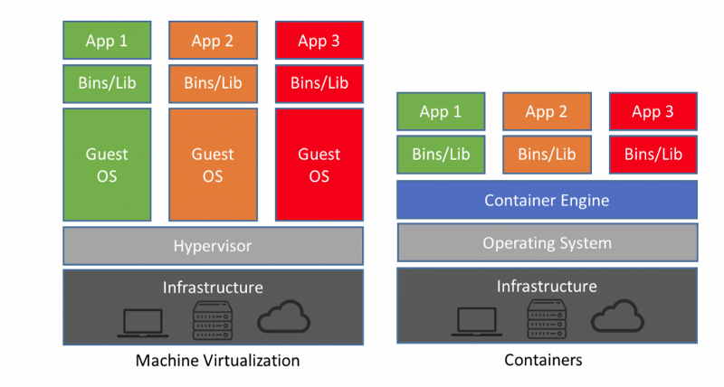

In the modern world, applications and the infrastructure they run on are moving to a multi-cloud, multi-platform and multi-service approach. This means that applications are being separated into service components that make up an application stack and run on a number of different platforms to deliver the business value, for example, some services may run in a container which is orchestrated by Kubernetes or Nomad, some may be run on Virtual Machines and the others run as Serverless functions using services like Lambda or FunctionApp. These services, whichever platform they are being run on, can be run either on-premise and/or in one or more of the biggest cloud providers (GCP, AWS, Azure, Alicloud) to create a multi-cloud hosted application.

The shift to this approach requires a change in mindset on many different fronts, especially security and secrets management as the networks that these applications use, move from a trusted network approach to a trustless network approach. In a trusted Network, credentials and secrets which allow application services to talk to one another are typically stored in the application code or in a configuration map as there is 100% control over the network and and it's perimeter, meaning all services and users inside the perimeter can be trusted. There are flaws in this approach but it was and still is a common practice for many organisations. Moving to a cloud approach means loosing some of that control over the network perimeters as the cloud providers are partially responsible for network security under the Shared Responsibility Model.

This breeds the introduction a different paradigm in Trustless Network approach as we can no longer have the same perimeters in place and can no longer trust the perimeters that are not completely under our control. In this new approach, secrets can no longer be stored in the same way using config maps or hardcoded in the application code, which presents a new challenge for application developers and DevOps engineers who are developing, deploying and running these applications and infrastructure at scale.
HashiCorp Vault is a secure secrets management platform which solves this problem, along with other problems we face in modern day application engineering including:

1. Encryption as a service
2. Key management

When architecting your vault deployment, there are some fundamental questions you need to answer before designing your cluster. This series of Architecting Vault blogs will address these questions in more detail and explore ways to find the most suitable solution for individual use-cases.
What platform do I host my vault cluster on?
The first decision we need to make is what platform to use to host a Production Vault cluster. The most appropriate decision will differ from one organisation to the next and will depend on their current cloud strategy (if they have one), their industry compliance requirements, and the business value of the secrets that will be stored in the Vault cluster.
In addressing this question, let's look at what options there are to host Vault and common hosting platforms in use today, from on-premise data centres to cloud providers.
Containers
Deploying Vault into a container is a useful option for local development as you can spin up local instances quickly and reliably; however, the very nature of how containers work make it the most risky platform to deploy a Production Vault cluster on. Containers are virtual workloads which share the kernel, libraries and binaries of the underlying host operating system, which is what makes them so lightweight and an attractive option to run micro-service architecture applications at scale.
The things that make Containers such an attractive option for many services are also the very things that make Containers the least secure option for running Vault clusters. The shared kernel, binaries and libraries presents a larger attack surface for the Vault cluster and exposes it to any vulnerabilities in the container run time which can be exploited by malicious attackers.
This increased attack surface is an acceptable risk to some organisations as the secrets stored in the Vault clusters are not deemed to be business critical and so this may still be a viable deployment option for many organisations. If using a container orchestration platform like Kubernetes, you will need to be aware that the more tenants (services) you have running in your Kubernetes cluster, the more risks there are to access your organisations secrets held in Vault clusters hosted on the same Kubernetes clusters as other tenants.
I reached out to HashiCorp for their advice on running Vault in Kubernetes and Co-founder & CTO Mitchell Hashimoto responded with the following.

I attended the HashiConf EU conference in Amsterdam last week and took the opportunity to speak to many of the HashiCorp Vault Software Engineers about this dilemma of running Vault on a Kubernetes cluster. The underlying message I got is that HashiCorp do not recommend running Vault in Production inside containers; however, they do recognise that some organisations will accept the increased risk and will deploy into Kubernetes, which is the reason they are currently working on Helm Charts to help these organisations deploy Vault into Kubernetes clusters quickly and reliably.

### Virtual Machines

Running Vault Clusters on virtual machines is the most secure way to host Vault in Cloud environments. The underlying technology that enables virtual machines to work is different to the underlying technology that enables containerisation and has a smaller attack surface. Virtual machines are run on Hypervisors, which is a technology that allows physical resources such as Storage disks, CPU cores, Memory and Network Interface Cards (NICs) to be accessed and consumed by virtual machines. Hypervisors typically sit on top of an operating system, much like KVM sits on top of Linux Operating systems and Hyper-V sits on top of Windows operating systems. These Operating Systems are installed on bare metal servers.

The reason that this a more secure way to run Vault in production than containers is the fact that each virtual machine has its own operating system installed on it, which each have their own kernel, libraries and binaries. The image below depicts the difference between container technologies and Hypervisor technologies.

### Bare Metal

For organisations that still have on-premise data centres hosting physical servers, running your production vault clusters on bare metal may be an option for them. The bare metal option is the most secure way of running Vault clusters in production as the hardware doesn't share itself with any other tenants. It provides you with complete control of the operating system and the underlying hardware.
This option does come with the most upfront cost to implement as you will need to procure dedicated server hardware for this deployment and will require physical resources to rack & stack the required hardware in the data centre and configure the networking accordingly. This option is most commonly used by financial organisations who's secrets are business critical and need the minimum attack surface exposure for compliance reasons as their systems hold financial data that underpins their very existence and in some cases the national / international economy.

### Making a decision

When making a decision as to how to host and run your Vault production clusters, I want to emphasise the fact that architectural design in general is a business driven exercise and should always exist to serve the purpose of achieving the business goals. There are some questions to which you need to seek answers for to help make the right decisions.

1. What is the cloud strategy of the organisation - If your organisation has a cloud strategy, you should understand what the long term goals are for this strategy, for example, if currently there is a mix of on-premise and cloud work loads, is the aim to migrate everything to the cloud and retire the data centre? In this example, bare metal is probably not the most appropriate option to align to your business goals.

2. What is the value of the secrets to the organisation - The answer to this question is key and can often dictate whether your Vault cluster should be hosted and run on premise or in the cloud. The example mentioned earlier with secrets unlocking access to financial data would more often than not, influence the decision to use Bare metal installations.

3. Budget constraints - If cost of running and time to value is of the upmost importance then you may consider using VMs to get you up and running quickly but if in the cloud, these VMs will increase your cloud costs and still impact any budget constraints. If you are already running Kubernetes clusters in the cloud, running Vault clusters in containers is probably the most cost effective solution; however, it comes with the security trade-off mentioned earlier. Bare metal installations will take the longest amount of time to deploy as you will need to undertake a procurement exercise and hardware installation tasks before you can start configuring your Vault instances and this can take many weeks or in some cases months.

Somewhere between the answers to these three questions will be the answer to your main question which is, what platform do I host my vault cluster on?

To conclude this chapter, I will leave you with a quote from the Vault Production Hardening guide for you to ponder.

"Similarly, running on bare metal should be preferred to a VM, and a VM preferred to a container. This reduces the surface area introduced by additional layers of abstraction and other tenants of the hardware."
